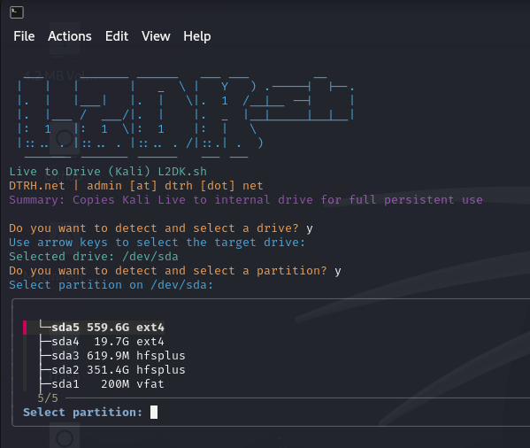

# L2DK.sh - Live to Drive (Kali)

<p align="center">
  
</p>

**L2DK.sh** is a powerful Bash script designed to convert a Kali Linux Live USB session into a full persistent installation on an internal drive. It allows you to move your live system to an internal disk, set up proper mounting, formatting, and UEFI boot with GRUB, all through an interactive terminal interface.

---

## Features

- **ASCII banner & colorful terminal UI** for a professional hacking aesthetic.
- **Interactive drive and partition selection** using `fzf`.
- **Step-by-step confirmation prompts** with double confirmation before destructive operations.
- **Progress bar** for key operations like copying the root filesystem.
- **Automatic mounting of special directories** (`/proc`, `/sys`, `/dev`, `/run`) for chroot operations.
- **Automatic fstab setup** for persistent root and EFI boot.
- **GRUB EFI installation** to make your internal drive bootable.

---

## Requirements

- Kali Linux Live USB (or any Debian-based Live system)
- `bash` or `zsh` shell
- `fzf` installed for interactive drive selection:

```bash
sudo apt update && sudo apt install -y fzf
```

- Root privileges to format partitions and install GRUB.

---

## Usage

1. Clone or copy the repository to your Live USB or local machine:

```bash
git clone https://github.com/DTRHnet/Shell-Scripts/Live2Drive-Kali
cd L2DK
```

2. Make the script executable:

```bash
chmod +x L2DK.sh
```

3. Run the script with root privileges:

```bash
sudo ./L2DK.sh
```

4. Follow the **interactive prompts** to:

   - Select the target drive and partition
   - Format the partition (optional)
   - Copy the Kali Live filesystem
   - Install GRUB for EFI boot

5. Reboot and boot from the internal disk. Your Kali Live system will now run fully persistent on your internal drive.

---

## Warning

⚠️ **This script will overwrite data on the selected partition.**  
Ensure you select the correct drive/partition to avoid data loss. Always double-check the final confirmation before proceeding.

---

## Screenshot


---

## License

This project is open-source under the **MIT License**. You may use, modify, and distribute it freely.

---

## Shouts

FzF team

--


## Author

**DTRH.net** | admin [at] dtrh [dot] net
